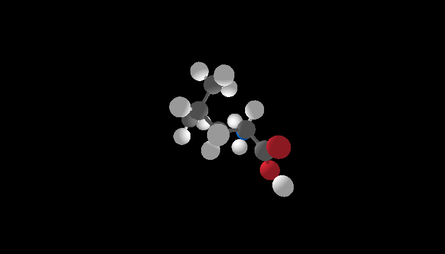
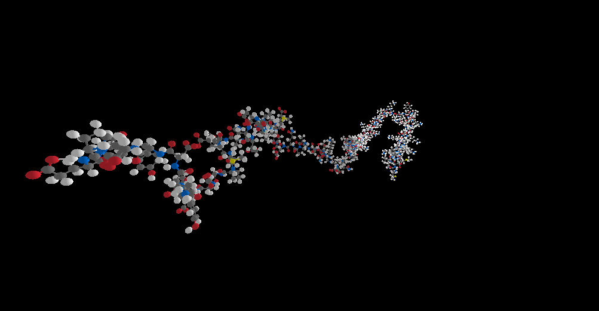

# Molecular-Model-Viewer

A molecular model viewer written in C++ using the raylib libraries. 
Currently, can take a leucine molecule and render it as spheres and 
lines. Can render a full protein. The leucine file is provided, but can be found here: 
https://www.rcsb.org/ligand/LEU.

## Features
- PDB file parsing: applies a custom parser to take atomic coordinates from PDB/CIF files.
- 3D rendering pipeline: Using sphere and cylinder primitives, it renders atoms and bonds using Raylib.
- Interactive Controls: Using affine transforms allows users to rotate, translate, and scale the rendered atom.

## Interactive Controls
- Press R to click the screen and drag the mouse to rotate the molecule in any direction.
- Press T to allow mouse dragging to move the molecule in any direction.
- Use the scroll wheel to zoom in or out on the molecule.
- Press B to toggle bonds on or off.
- Press A to toggle atoms on or off.

## Docker Version
A toy environment is added to the repo, this will allow users to try out the application quick and easy

- Download Docker
    - If using windows, make sure to have WSL integration turned on. 
- Run Docker
- Using WSL or Linux type in the following commands
```
cd ~
git clone https://github.com/RL0109/Molecular-Model-Viewer molecule_viewer
cd molecule_viewer
docker build -t molviewer .
./run.sh
```
- First run will need to build the image to work.
- There exists three molecules you can run
```
molecules/LEU.cif
molecules/1XQ8.cif
molecules/9PZB.cif
```
- You can run them like so
```
./run.sh molecules/1XQ8.cif
```
- If no molecule is given, it will automatically run LEU.cif
- Please be aware that this will run through the CPU instead of the GPU, so larger molecules 
may run slower. 

## Required raylib files
The following raylib files need to be in the directory of the application to compile 
correctly: 

- raylib.h
- raymath.h
- rlgl.h  

These files can be found on the raylib website: https://www.raylib.com/

When compiling via GCC or MinGW you can do the following:
**Windows**
``` 
g++ main.cpp -L "location\of\raylib\binaries" -lraylib -lgdi32 -lwinmm -o app.exe.
```
**Linux** 
```
g++ main.cpp -lraylib -lGL -lm -lpthread -ldl -lrt -lX11 -o app
```

## Example Photos

Rendering of Leucine Model



Rendering of Alpha Synuclein Model 

